# Winter Arc (ZimArc)

Create gym routines, log workouts with rest timers, and track progress — with photo-backed exercises and optional workout reminders.

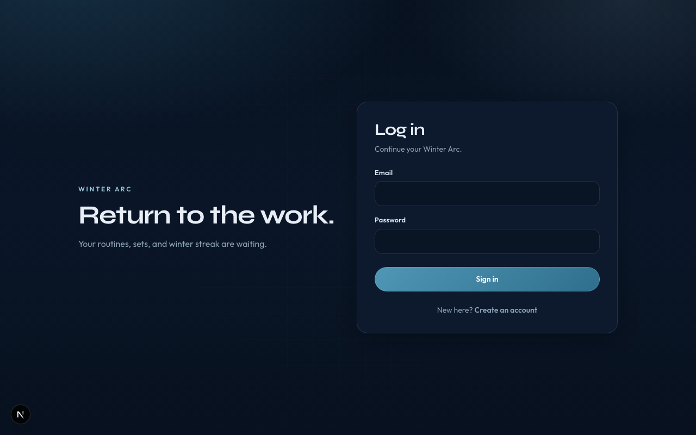

## Features

- Email/password auth via Supabase
- Routine builder with multi-day splits and exercise photo library
- Workout logging with rest timer and editable history
- Progress: streaks, volume, and per-exercise PRs
- Reminder settings (browser notifications + service worker)
- Installable PWA (production)

## Quick start

```bash
npm install
cp .env.example .env
# fill NEXT_PUBLIC_SUPABASE_URL and NEXT_PUBLIC_SUPABASE_ANON_KEY
npm run dev
```

Open [http://localhost:3000](http://localhost:3000).

Before first use, run `supabase/000_all.sql` in the Supabase SQL Editor (or migrations `001`–`004`). Full setup: [docs/SETUP.md](docs/SETUP.md).

## App walkthrough

| Step | Screen |
|------|--------|
| Sign in |  |
| Create account | 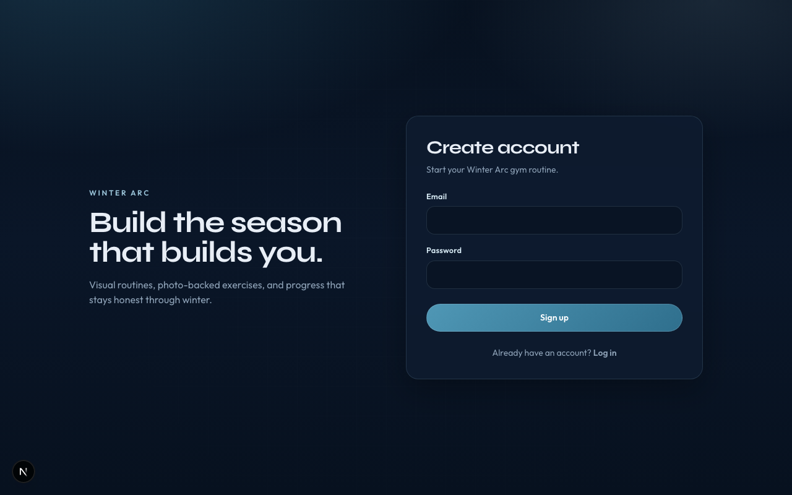 |
| Home | 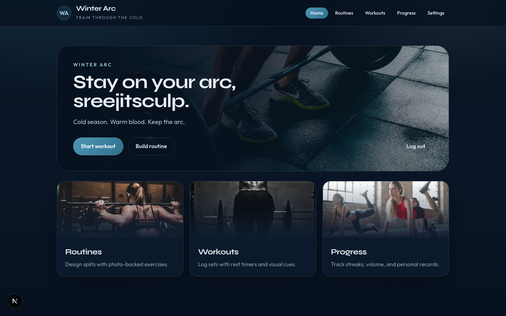 |
| Routines | 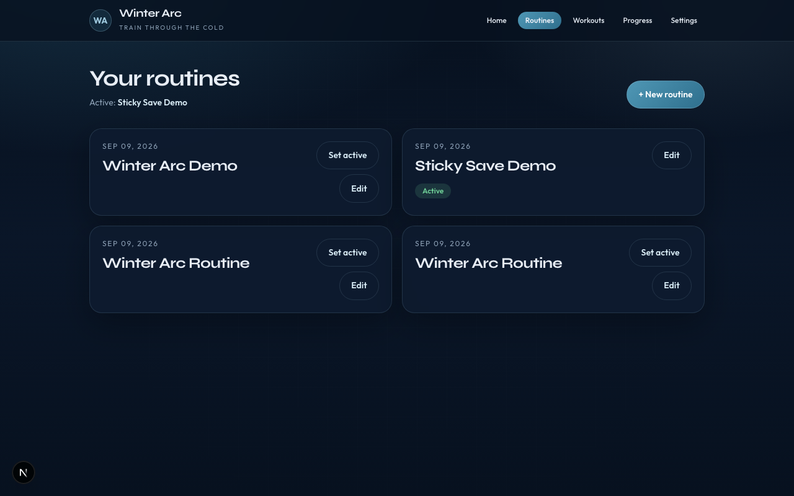 |
| Build a routine | 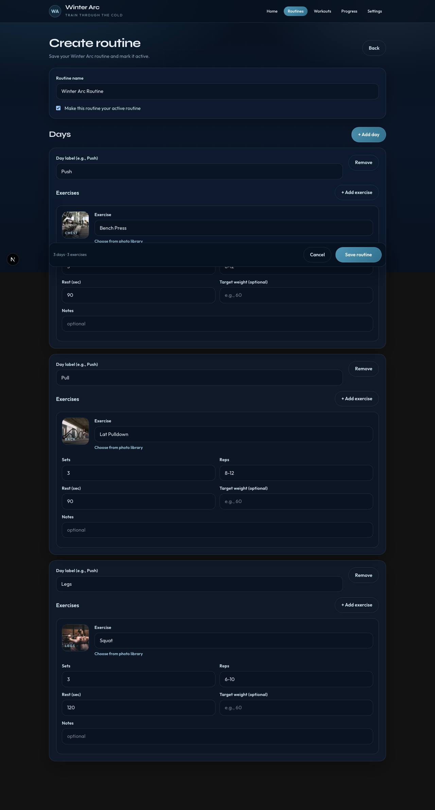 |
| Exercise photos | 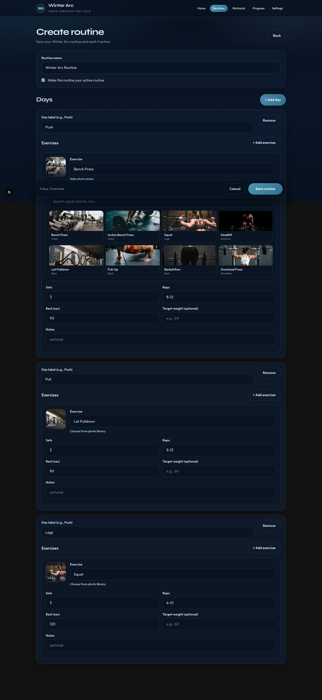 |
| Log a session | 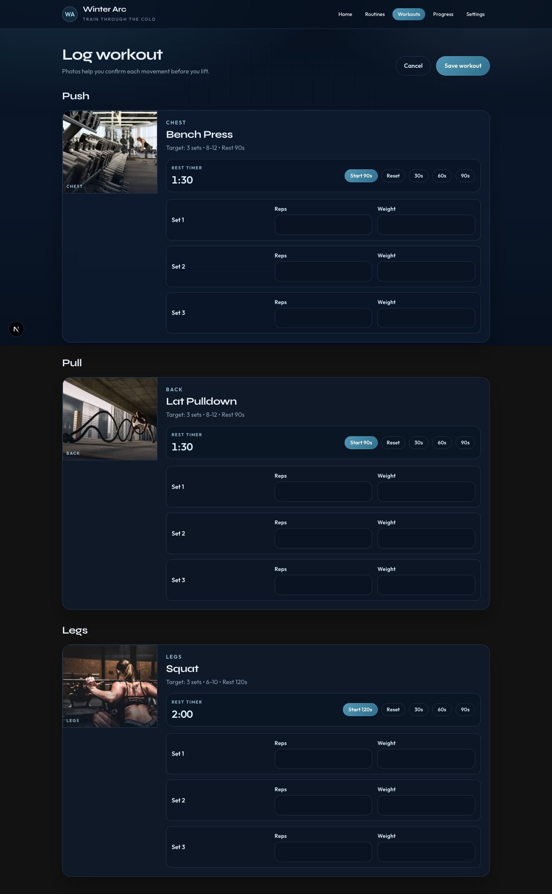 |
| Workout history | 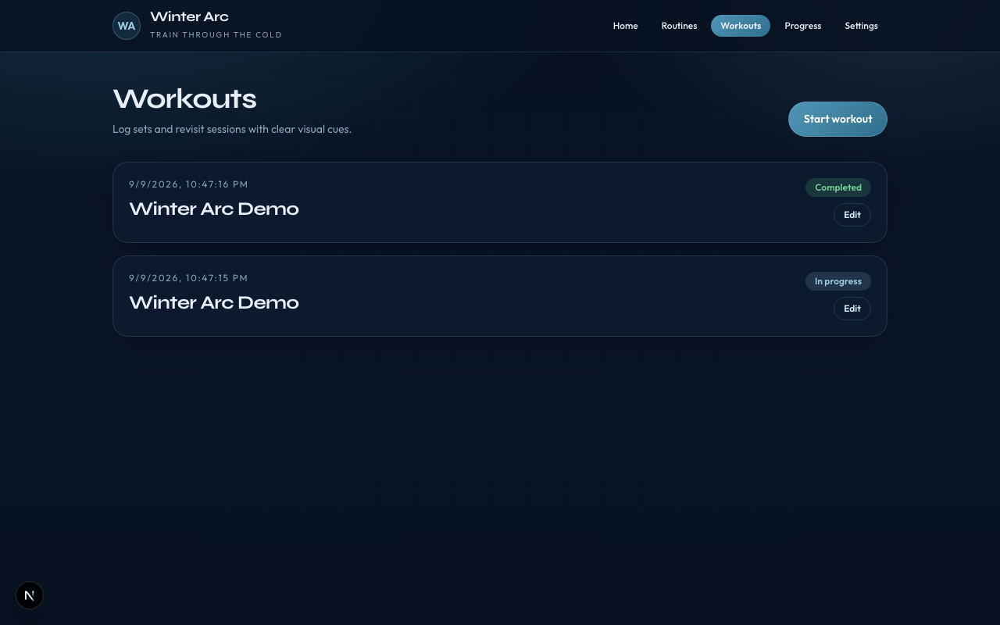 |
| Progress | 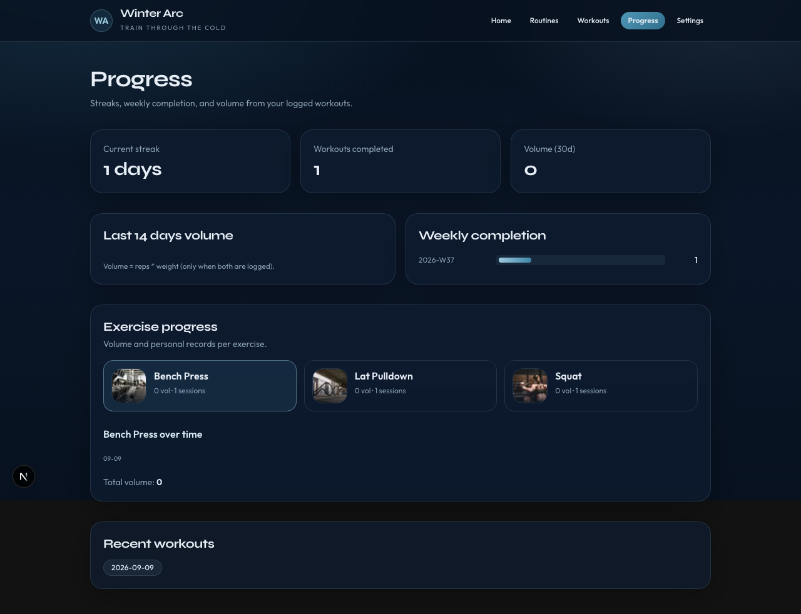 |
| Reminders | 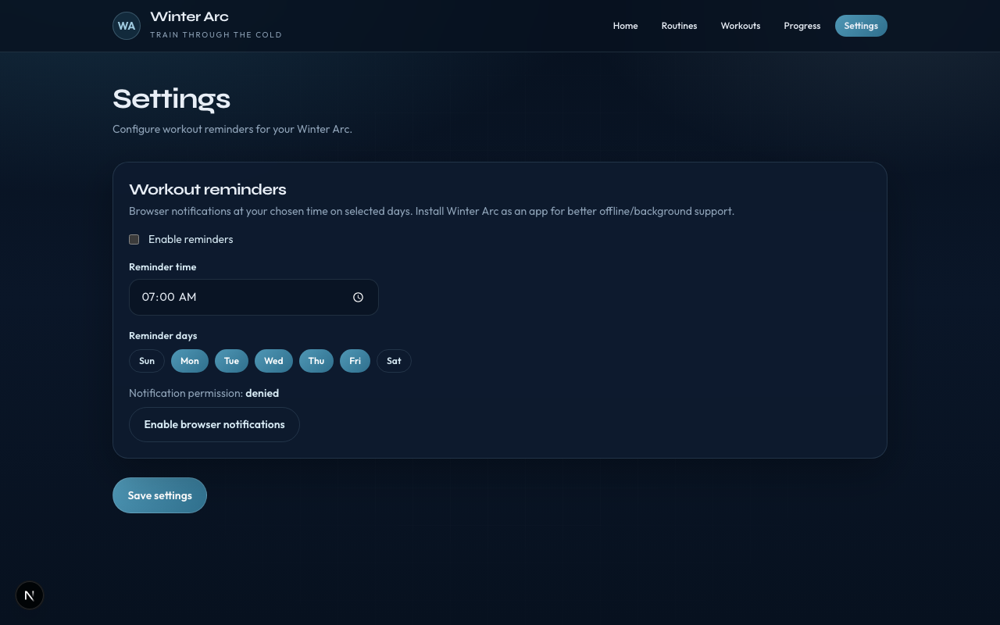 |

### Mobile

| Dashboard | Routine builder |
|-----------|-----------------|
| 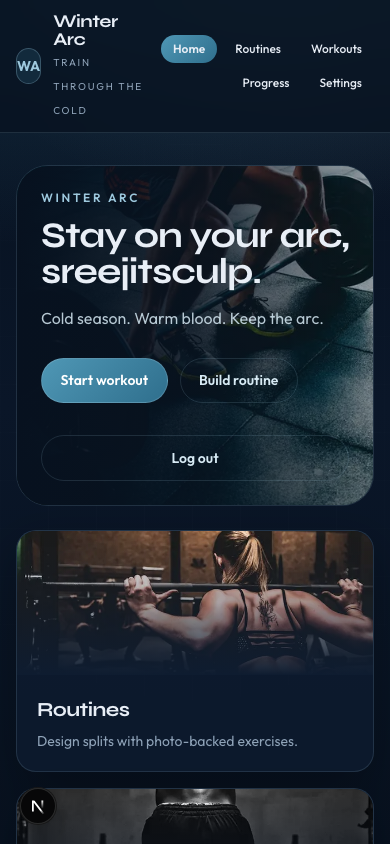 | 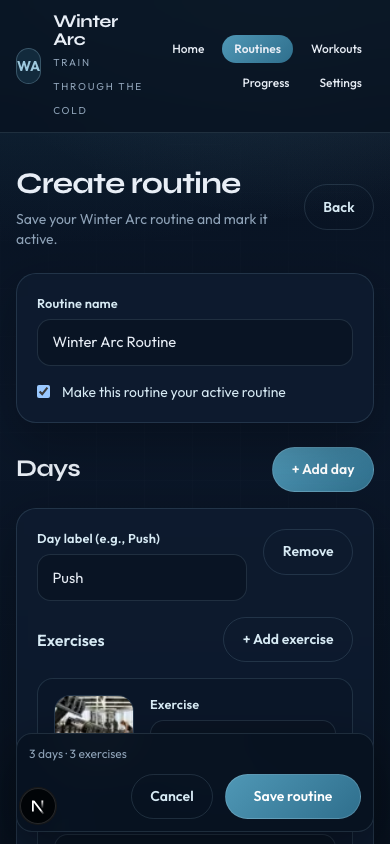 |

## Docs

- [Setup](docs/SETUP.md) — env, Auth URLs, SQL migrations
- [Database](docs/DATABASE.md) — schema and migration order
- [Auth](docs/AUTH.md) — login, signup, callback flow
- [Architecture](docs/ARCHITECTURE.md) — app structure
- [Screenshots](docs/SCREENSHOTS.md) — regenerate product shots
- [Contributing](CONTRIBUTING.md)

## Stack

Next.js (App Router) · TypeScript · Tailwind CSS · Supabase Auth + Postgres · `@supabase/ssr`

## License

Private / personal project unless otherwise noted.
