<p align="center">
  
</p>

<h1 align="center">Winter Arc (ZimArc)</h1>

<p align="center">
  Build gym routines, log every set with a rest timer, and watch your streaks and volume grow through the season.
</p>

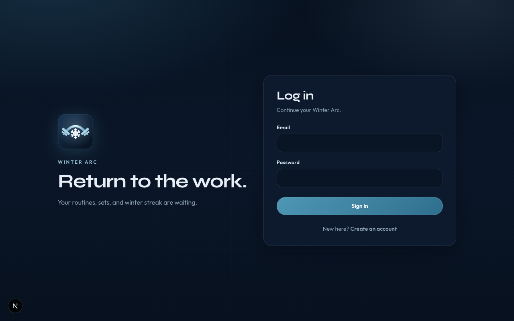

## Features

- **Accounts** — email/password sign-up and login via Supabase Auth.
- **Routine builder** — multi-day splits (e.g. Push / Pull / Legs) with sets, reps, rest, target weight, and notes per exercise.
- **Exercise photo library** — pick common lifts from a searchable catalog so every exercise has a reference photo.
- **Workout logging** — start a session from your active routine, log reps and weight per set, and use a built-in rest timer.
- **Editable history** — reopen past sessions to fix or complete them.
- **Progress** — current streak, weekly completion, 30-day volume, and per-exercise trends.
- **Reminders** — pick days and a time for browser notifications.
- **Installable** — works as a PWA (add to home screen) in production builds.

## How it works

1. Create an account and log in.
2. Build a routine and mark it **active** — only one routine is active at a time.
3. Hit **Start workout**: the session is generated from your active routine's days and exercises.
4. Log reps and weight, use the rest timer between sets, then **Save workout**.
5. Check **Progress** for streaks and volume, and edit any past session from **Workouts**.

## Requirements

- Node.js **20.9+**
- A free [Supabase](https://supabase.com) project

## Getting started

### 1. Install and configure

```bash
npm install
cp .env.example .env
```

Fill in `.env` from Supabase **Project Settings → API**:

| Variable | Value |
|----------|-------|
| `NEXT_PUBLIC_SUPABASE_URL` | Project URL |
| `NEXT_PUBLIC_SUPABASE_ANON_KEY` | `anon` public key |

### 2. Create the database tables

In the Supabase **SQL Editor**, paste and run [`supabase/000_all.sql`](supabase/000_all.sql). It combines migrations `001`–`004` (routines, workouts, profiles/reminders, safe routine editing). Details: [docs/DATABASE.md](docs/DATABASE.md).

### 3. Set auth redirect URLs

In Supabase **Authentication → URL Configuration**:

- **Site URL:** `http://localhost:3000`
- **Redirect URLs:** `http://localhost:3000/auth/callback` and `http://localhost:3000/**`

For local testing you can turn off **Confirm email** (Authentication → Providers → Email) so new accounts can log in immediately.

### 4. Run

```bash
npm run dev
```

Open [http://localhost:3000](http://localhost:3000). Full walkthrough: [docs/SETUP.md](docs/SETUP.md).

## Scripts

| Command | What it does |
|---------|--------------|
| `npm run dev` | Start the dev server |
| `npm run build` | Production build |
| `npm start` | Serve the production build |
| `npm run lint` | Run ESLint |
| `npm run screenshots` | Recapture the README screenshots (needs a running app and a test account — see [docs/SCREENSHOTS.md](docs/SCREENSHOTS.md)) |
| `npm run icons` | Regenerate the logo, favicon, and PWA icons |

## App walkthrough

| Step | Screen |
|------|--------|
| Create account | 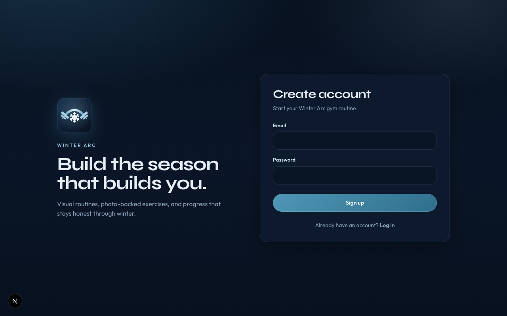 |
| Home | 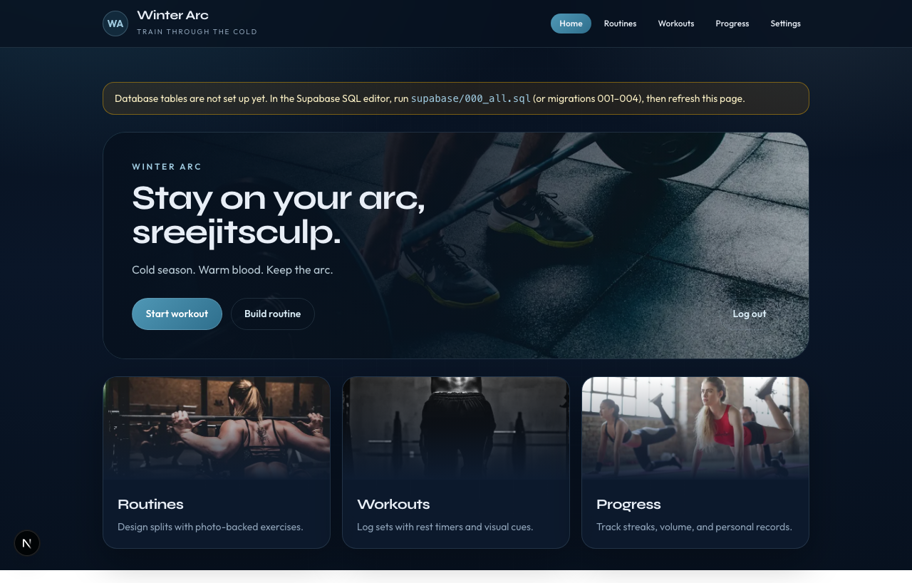 |
| Routines | 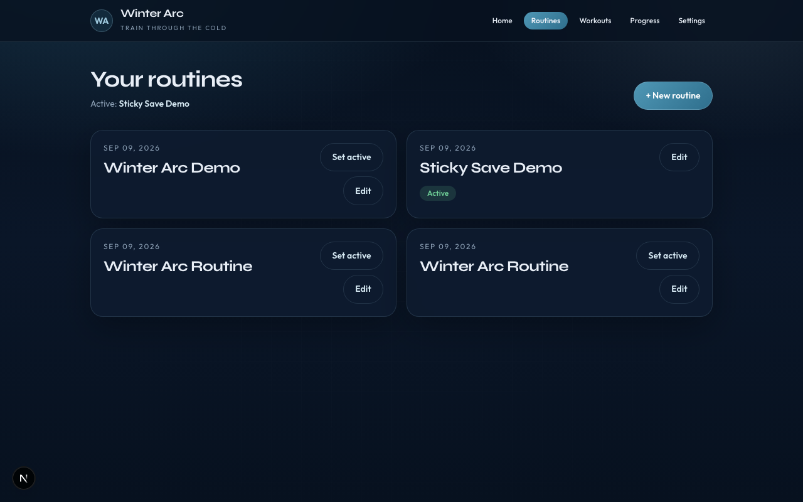 |
| Build a routine | 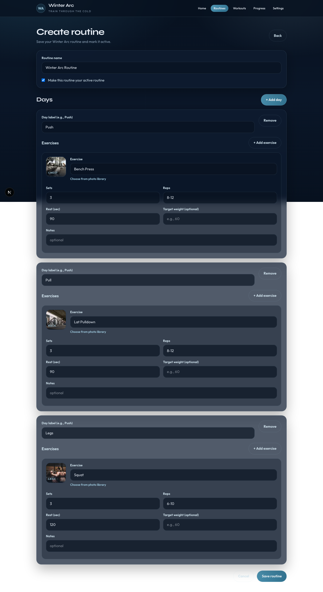 |
| Exercise photos | 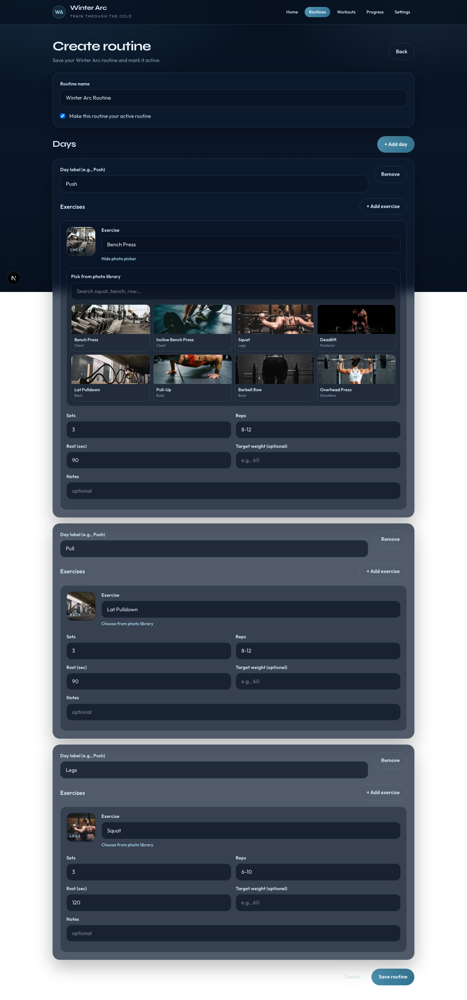 |
| Log a session | 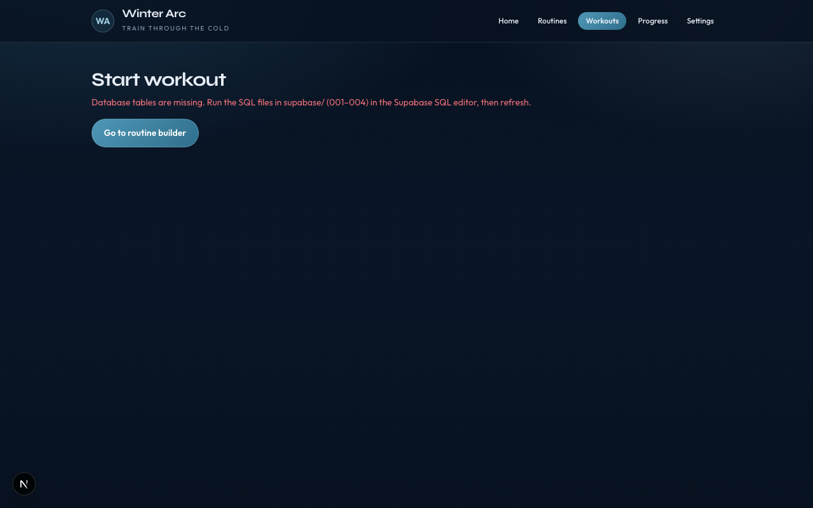 |
| Workout history | 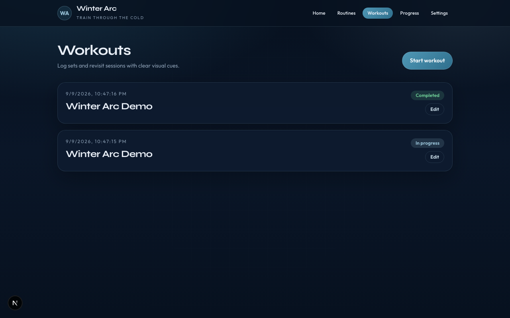 |
| Progress | 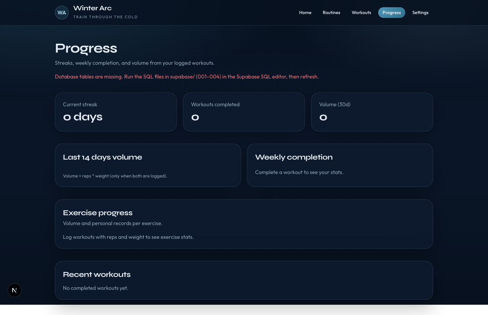 |
| Reminders | 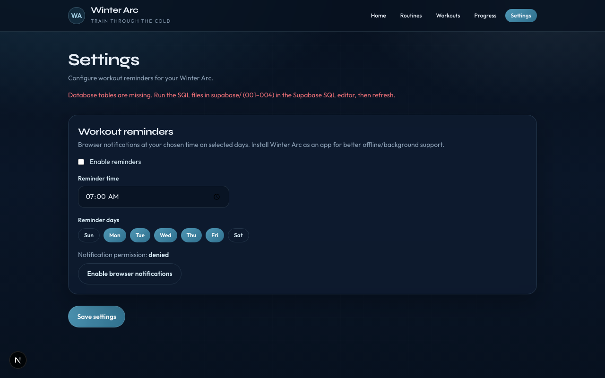 |

### Mobile

| Dashboard | Routine builder |
|-----------|-----------------|
| 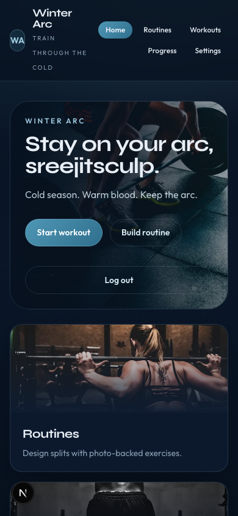 | 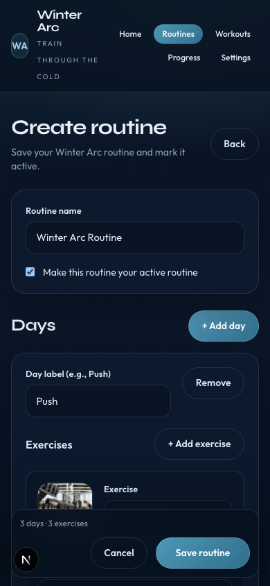 |

## Project structure

```
src/
  app/            Pages (dashboard, routines, workouts, progress, settings, auth)
  components/     Shared UI — app shell, logo, routine editor, rest timer, exercise media
  lib/supabase/   Supabase clients and data helpers (routines, workouts, profile)
  lib/exercises/  Exercise photo catalog
supabase/         SQL migrations (000_all.sql = 001–004 combined)
scripts/          Screenshot capture and icon generation
docs/             Setup, database, auth, architecture, screenshots
public/           Service worker, web manifest, icons
```

## Troubleshooting

| Symptom | Fix |
|---------|-----|
| "Database tables are missing" | Run `supabase/000_all.sql` in the Supabase SQL Editor, then refresh. |
| Login fails / `ERR_NAME_NOT_RESOLVED` | Free Supabase projects pause after about a week of inactivity. Restore the project from the Supabase dashboard. |
| "No active routine" on Start workout | Open **Routines** and click **Set active** on one routine. |
| Signup error `over_email_send_rate_limit` | Supabase limits confirmation emails. Wait, or disable **Confirm email** for local testing. |
| Port 3000 already in use | Stop the other app, or run `npx next dev -p 3100` (and add that port to your Supabase redirect URLs). |

## Docs

- [Setup](docs/SETUP.md) — env, auth URLs, SQL migrations
- [Database](docs/DATABASE.md) — schema and migration order
- [Auth](docs/AUTH.md) — login, signup, and callback flow
- [Architecture](docs/ARCHITECTURE.md) — app structure
- [Screenshots](docs/SCREENSHOTS.md) — regenerate product shots
- [Contributing](CONTRIBUTING.md)

## Logo

The mark is a barbell bending into an arc over a snowflake — the "arc" of a heavy lift, through winter. Its geometry lives in `scripts/generate-icons.mjs`; run `npm run icons` to regenerate every size from it.

## Stack

Next.js 16 (App Router) · React 19 · TypeScript · Tailwind CSS 4 · Supabase Auth + Postgres · `@supabase/ssr`

## License

Private / personal project unless otherwise noted.
